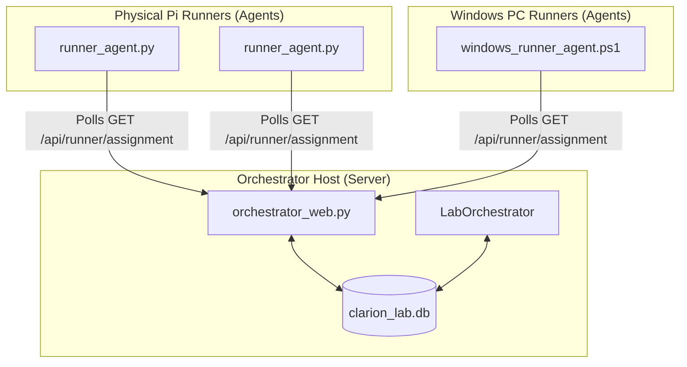

# Clarion Lab Orchestrator

The **Clarion Lab Orchestrator** is a client-server orchestration system that coordinates network traffic simulation and active device profiling across a physical network lab. It provides a centralized Web Dashboard (Flask) and a background engine that schedules, assigns, and monitors identity rotation campaigns for user workstations (802.1X/Dot1x) and IoT/OT devices (MAC Authentication Bypass/MAB).

---

## Architecture Overview

Unlike traditional lab systems, the Orchestrator uses a **pull-based (client/server) agent model**. 

* **No Inbound SSH Required:** Runner hosts run local agents that poll the central Orchestrator HTTP API (`/api/runner/assignment/<runner_id>`) for identity assignments, download connection details, run simulated user traffic, and report back status.
* **Database Source of Truth:** All configurations (runners, identities, services, connectivity policies, health profiles) are stored in a centralized SQLite database (`clarion_lab.db`).
* **Active Directory Integration:** Supports querying and importing AD user lists directly into the orchestrator database via LDAP.

---

## Core Features

1. **Interactive Web Dashboard:**
   - Real-time status tracking of all runners, active user sessions, and simulated device states.
   - Comprehensive configuration panels to manage runners, services, and network access policies.
   - Interactive Active Directory browser to search and import lab identities.
2. **Runner Provisioning & Automation:**
   - Automatic WiFi and 802.1X supplicant configurations on Pi agents using NetworkManager (`nmcli`).
   - Windows Agent PowerShell client with built-in watchdog loops for enterprise PC emulation.
3. **Identity Realism Engine:**
   - Alternates runner MAC addresses to mimic physical hardware swaps (using custom vendor OUIs for Dell, HP, Apple, Siemens, Moxa, etc.).
   - Modifies DHCP Options (Option 60 Vendor Class) and HTTP User-Agents dynamically to trigger Cisco ISE device profiling.
   - Randomizes session durations and traffic pacing (min/max sleeps) based on defined role behaviors (e.g. Sales, Finance, IT, OT).
4. **Preflight Auditing & Automated Recovery:**
   - Verifies system services, interfaces, routing tables, and default gateways on each runner before campaigns start.
   - Background controller checks for offline agents, hung sessions, or network failures, triggering automated remediations (e.g. restarting services, cycling interfaces).
5. **Clarion Policy Verification:**
   - Queries CMDB API and compares active runner sessions against expected policy configurations.
   - Validates allow/deny rules (firewall checks) by instructing runners to attempt connections to target services and reporting the outcomes.

---

## Repository Structure

* [orchestrator_web.py](file:///Users/stevengerhart/workspace/github/dentroio/orchestrator/orchestrator_web.py): The Flask web application containing the dashboard UI and API endpoints.
* [lab_orchestrator.py](file:///Users/stevengerhart/workspace/github/dentroio/orchestrator/lab_orchestrator.py): The main background engine managing campaigns, assignments, and active identity pools.
* [db.py](file:///Users/stevengerhart/workspace/github/dentroio/orchestrator/db.py): SQLite database manager and migration script wrapper.
* [runner_agent.py](file:///Users/stevengerhart/workspace/github/dentroio/orchestrator/runner_agent.py): The polling agent script running as a systemd service on Pi runners.
* [auto_lab_runner.py](file:///Users/stevengerhart/workspace/github/dentroio/orchestrator/auto_lab_runner.py): The execution script spawned by the agent to perform DHCP spoofing, HTTP emulation, and traffic generation.
* [runner_health_controller.py](file:///Users/stevengerhart/workspace/github/dentroio/orchestrator/runner_health_controller.py): Background process monitoring runner telemetry and applying automated recovery.
* [runner_audit.py](file:///Users/stevengerhart/workspace/github/dentroio/orchestrator/runner_audit.py) / [runner_remediate.py](file:///Users/stevengerhart/workspace/github/dentroio/orchestrator/runner_remediate.py): Scripts performing preflight audits and SSH-based runner recoveries.
* [launch_presets.py](file:///Users/stevengerhart/workspace/github/dentroio/orchestrator/launch_presets.py): Hardcoded list of launch campaigns (e.g., Quick start, population campaigns, department groupings).
* [ad_connector.py](file:///Users/stevengerhart/workspace/github/dentroio/orchestrator/ad_connector.py): LDAP interface to query and import users from Active Directory.
* [templates/](file:///Users/stevengerhart/workspace/github/dentroio/orchestrator/templates/) / [static/](file:///Users/stevengerhart/workspace/github/dentroio/orchestrator/static/): Dashboard HTML templates and stylesheet/JavaScript assets.
* [tools/](file:///Users/stevengerhart/workspace/github/dentroio/orchestrator/tools/): Scripts for DB migrations and diagnostic tools.
* [windows-installer/](file:///Users/stevengerhart/workspace/github/dentroio/orchestrator/windows-installer/): Windows PowerShell agent scripts and installer configuration.

---

## Detailed Documentation

Please refer to the following guides in the [docs/](file:///Users/stevengerhart/workspace/github/dentroio/orchestrator/docs/) directory for detailed setup and usage information:

* **[Quick Start Guide](file:///Users/stevengerhart/workspace/github/dentroio/orchestrator/docs/QUICK_START.md):** Step-by-step instructions to get the orchestrator dashboard running and launch your first campaign.
* **[Deployment Guide](file:///Users/stevengerhart/workspace/github/dentroio/orchestrator/docs/DEPLOYMENT_GUIDE.md):** Manual deployment steps for the Orchestrator server and both Pi and Windows runner agents.
* **[Runner Preflight & Audits](file:///Users/stevengerhart/workspace/github/dentroio/orchestrator/docs/RUNNER_PREFLIGHT_AUDIT.md):** Details on runner health checks, interface overrides, and resolving network connection failures.
* **[Launch Sessions](file:///Users/stevengerhart/workspace/github/dentroio/orchestrator/docs/LAUNCH_SESSION.md):** How the campaign presets, concurrency limits, and rotation settings coordinate runner behaviors.
* **[Peer Connectivity Verification](file:///Users/stevengerhart/workspace/github/dentroio/orchestrator/docs/PEER_CONNECTIVITY_PLAN.md):** Overview of connectivity policies and how firewall rules are audited using test matrices.
* **[Lab Master Plan](file:///Users/stevengerhart/workspace/github/dentroio/orchestrator/docs/LAB_MASTER_PLAN.md):** Details of the physical layout, subnet assignments, and VLAN topologies of the Clarion Lab network.
