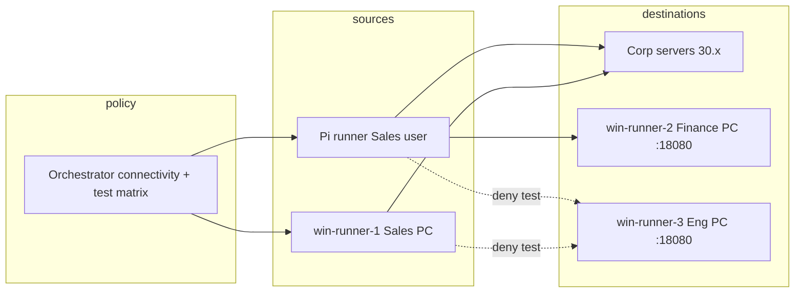

# Peer (User-to-User) Connectivity Plan

**Status:** Design / logistics  
**Last updated:** 2026-05-19  
**Goal:** Model and test **persona-to-persona** access (e.g. Sales cannot reach Engineering) using **Windows runners as destinations**, visible in the orchestrator UI alongside server connectivity.

---

## Problem today

| What exists | What’s missing |
|-------------|----------------|
| **Persona → service** (`connectivity_policies`) — HTTP backends on 30.x / 31.x / 40.x | **Persona → persona** — no matrix for “Sales may talk to Finance user PC” |
| Pi runners rotate dot1x users per `persona_set` | Windows runners are **sources only** (outbound HTTP) |
| Policy test matrix is **persona × service** | No **persona × peer persona** tests |
| 4 Windows runners in lab DB | All four currently have `persona_set: ["Sales"]` and `fallback_persona: Sales` |

Live lab: Windows **persona = logged-in AD user** (identity DB `department` / `persona`), not fixed `persona_set` on the runner. `fallback_persona` applies only when no interactive user is logged in or the user is unknown in the identity DB.

---

## Target lab layout (from LAB_MASTER_PLAN)

### Windows hosts — stable AD users (one persona per machine)

| Runner ID | Intended hostname | Logged-in AD user | Persona | `persona_set` | `fallback_persona` |
|-----------|-------------------|-------------------|---------|---------------|-------------------|
| `win-runner-1` | WIN-SALES-01 | `alice.johnson` | Sales | `["Sales"]` | Sales |
| `win-runner-2` | WIN-FINANCE-01 | `jane.robinson` | Finance | `["Finance"]` | Finance |
| `win-runner-3` | WIN-ENG-01 | `henry.brown` | Engineering | `["Engineering"]` | Engineering |
| `win-runner-4` | WIN-IT-01 | `victor.wilson` | IT | `["IT"]` | IT |

**Action (ops):** Log the correct user on each PC before enabling traffic. Wrong user → wrong persona in ISE/Clarion even if runner config is fixed.

**Action (config):** Update runner records in orchestrator DB (Configuration tab or `POST /api/config`) so each `win-runner-*` matches the row above.

### Pi runners — churn (unchanged)

| Runner | Persona set | Role |
|--------|-------------|------|
| pi-runner-1 | Sales | Rotating Sales users → hits servers **and** (later) peer Windows targets |
| pi-runner-2 | Finance | Same for Finance |
| pi-runner-3 | Engineering | Same for Engineering |
| pi-runner-4 | IT | Same for IT |

Pi runners prove correlation under identity rotation; Windows runners prove **stable peer baselines**.

---

## Architecture: peers as services

Reuse the existing **service catalog + connectivity_policies** model instead of inventing a parallel protocol.

### 1. Register each Windows host as a service

For each Windows runner, add a service (auto-generated or manual):

```json
{
  "id": "srv_peer_win_finance",
  "name": "Peer: Finance workstation (win-runner-2)",
  "protocol": "http",
  "target": "<finance-pc-fqdn-or-ip>",
  "port": 18080,
  "path": "/clarion/lab/ping",
  "tags": ["peer", "persona:Finance", "runner:win-runner-2"]
}
```

- **`target`**: From runner telemetry (`hostname`, `fqdn`) or static lab DNS.
- **`port`**: Dedicated lab listener on the Windows agent (see below).
- **`tags` / naming convention**: Lets the UI group “Peer endpoints” separately from datacenter servers.

### 2. Production connectivity = who may reach whom

Example policy intent:

| Source persona | May reach peer services | Must NOT reach |
|----------------|-------------------------|----------------|
| Sales | `srv_peer_win_sales` (self), optional shared apps | `srv_peer_win_engineering`, `srv_peer_win_it` |
| Finance | Finance peer + corp apps | Engineering peer, … |
| Engineering | Eng peer + code/iotdev | Sales-only peers (optional) |
| IT | All peer services (admin) | — |

Express by adding peer service IDs to `connectivity_policies[<persona>]` — same checkbox UI as today, with a **“Peer workstations”** section in the Production Policies sub-tab.

### 3. Policy tests = prove violations

Use existing `policy_test_settings.test_matrix`:

- **Allow test:** Sales → Finance peer with matrix cell **force allow** (expect pass if network allows).
- **Deny test:** Sales → Engineering peer with matrix cell **force deny** (runner attempts; expect block / failure).

Optional: extend matrix columns to show **peer personas** (not only HTTP server columns) — UX improvement, same backend data.

### 4. Windows agent: destination mode

Today `windows_runner_agent.ps1` only **originates** HTTP(S). For peer testing:

| Phase | Work |
|-------|------|
| **A** | Add lightweight **HTTP listener** on each PC (e.g. `http://+:18080/clarion/lab/ping/` → 200 OK). URL ACL + firewall rule in installer. |
| **B** | Orchestrator **syncs** peer services from runner telemetry (`hostname`, `persona`, last known IP). |
| **C** | Enforce `persona_set`: if logged-in user’s persona ∉ runner’s `persona_set`, use `fallback_persona` only for discovery (no traffic) or reject plan. |

Phase A is required before Pi/Windows sources can “call” a peer.

### 5. Traffic paths



NetFlow/ISE sees **user → user IP** flows; Clarion groups by persona if identity correlation is correct.

---

## UI changes (Connectivity tab)

Add a fourth sub-tab or section groups:

| Sub-tab | Content |
|---------|---------|
| Production Policies | Existing server checkboxes + **Peer workstations** group (4 Windows services) |
| Policy Tests | Existing list UI; filter/tag peer targets |
| **User Peers** (new) | Persona × persona matrix: allowed / denied / no policy (drives which peer service IDs are in `connectivity_policies`) |
| Matrix View | Optional; include peer columns |

**User Peers matrix** (recommended default for “Sales can’t talk to Engineering”):

- Rows = source persona (Sales, Finance, Engineering, IT)
- Columns = destination persona (same four)
- Cell = Allow | Deny | Inherit (no direct peer rule)
- Saving translates to adding/removing `srv_peer_win_*` from each row’s `connectivity_policies` entry.

This is easier to reason about than a wide service grid for humans.

---

## Data model (proposed)

```json
{
  "peer_connectivity_policies": {
    "Sales": { "allowed_peers": ["Sales", "Finance"], "denied_peers": ["Engineering", "IT"] },
    "Finance": { "allowed_peers": ["Sales", "Finance", "IT"] },
    "Engineering": { "allowed_peers": ["Engineering", "IT"] },
    "IT": { "allowed_peers": ["Sales", "Finance", "Engineering", "IT"] }
  },
  "peer_runner_map": {
    "Finance": "win-runner-2",
    "Engineering": "win-runner-3",
    "IT": "win-runner-4",
    "Sales": "win-runner-1"
  }
}
```

**Implementation note:** v1 can avoid a new store by **materializing** peer rules into `connectivity_policies` + `services` on save. v2 can persist `peer_connectivity_policies` and sync on load.

---

## Code changes (implementation phases)

### Phase 0 — Lab hygiene (no new code)

1. Fix `win-runner-2/3/4` `persona_set` + `fallback_persona` in orchestrator config.
2. Log correct AD users on each Windows PC (see table above).
3. Document actual hostnames/IPs in runner `host` / telemetry fields.

### Phase 1 — Peer services + UI section

- `lab_orchestrator.py`: helper `_peer_services_for_persona()`, materialize peer service IDs into URL resolution.
- Dashboard: peer checkbox group under Production Policies; peer rows in Policy Tests list.
- Seed four `srv_peer_win_*` services (manual or API script).

### Phase 2 — Windows listener + auto-target

- `windows_runner_agent.ps1`: optional `-ListenPort 18080`, minimal ping endpoint.
- Installer: firewall + URL ACL.
- Orchestrator: on telemetry, update peer service `target` if hostname/IP changed.

### Phase 3 — Persona × persona UI + enforcement

- New **User Peers** sub-tab; save → `peer_connectivity_policies` + sync to `connectivity_policies`.
- `get_windows_host_plan()`: enforce `persona_set` vs matched identity persona.
- Ground truth log: include peer destination persona in `expected_destinations`.

### Phase 4 — Advanced

- SMB/RDP probes (realistic lateral movement).
- Pi runner policy tests to peer URLs in `traffic_gen.py` (already supports HTTP policy cases).
- Violation runs: Pi-Rebuild-5 style fault injection.

---

## Identity database

Identities already include representatives per department (`identities1.json` / DB):

- Sales: `alice.johnson`, …
- Finance: `jane.robinson`, …
- Engineering: `henry.brown`, …
- IT: `victor.wilson`, `charlie.davis`, …

**Gaps to close:**

1. Ensure each Windows host’s **logged-in user** exists in DB with matching `department` / `persona`.
2. Add 1–2 extra users per department if Pi rotation should not reuse the same username as the Windows baseline (optional).
3. AD group names in identities (`groups[]`) if ISE policies are group-based — align with real AD.

---

## Example policy: “Sales cannot talk to Engineering”

1. Create `srv_peer_win_engineering` → `http://<eng-pc>:18080/clarion/lab/ping`.
2. **Do not** add that service ID to `connectivity_policies["Sales"]`.
3. In policy test matrix: `Sales` + `srv_peer_win_engineering` = **force deny** (generates attempt + failure for validation).
4. Optionally add **force allow** for `Sales` → `srv_peer_win_finance` to prove positive case.

ISE/Clarion should show deny flows when network policy matches; orchestrator policy test panel reports pass/fail on observed HTTP outcome.

---

## Open decisions

| Question | Recommendation |
|----------|----------------|
| Same user on Windows and Pi? | Windows = canonical baseline user per persona; Pi rotates *other* users in same department. |
| IT reaches everyone? | Yes for peer matrix; matches admin troubleshooting persona. |
| IoT personas talk to users? | Out of scope for v1; IoT stays server/backend only. |
| Listener port | `18080` default; configurable per runner. |

---

## Next steps

1. Confirm physical mapping: which lab PC is `win-runner-1` … `4` (stickers / DHCP reservations).
2. Apply runner config + AD logins (Phase 0).
3. Prioritize Phase 1 (peer services in UI) vs Phase 2 (Windows listener) based on whether probes to existing SMB/445 or RDP are acceptable interim tests.

When ready to implement, start with Phase 0 config patch + Phase 1 orchestrator helpers; Phase 2 requires Windows agent + installer update on all four hosts.
