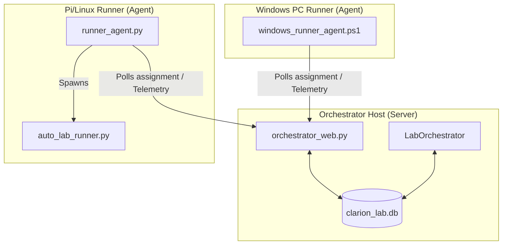

# Clarion Lab Orchestrator – Operator & Architecture Guide

The **Clarion Lab Orchestrator** is a versatile, agent-based client-server orchestration system designed to coordinate network traffic generation, device profiling simulation, and security policy auditing across virtual or physical network environments. 

While initially developed to test the **Clarion Network Analytics** platform, the orchestrator is structurally decoupled and can be used for any project requiring automated, multi-host, profile-driven network traffic simulation.

---

## 1. System Architecture

The orchestrator utilizes a **pull-based (client/server) agent model**. Sibling runner hosts (agents) poll the central orchestrator controller for identity assignments, eliminating the need for inbound SSH or firewall modifications on target networks.



### Core Components
* **Orchestrator Web Console (`orchestrator_web.py`):** A Flask web application providing the REST API endpoints and a real-time tracking dashboard.
* **Orchestration Engine (`lab_orchestrator.py`):** The background scheduler that manages campaign presets, concurrency thresholds, and runner states.
* **Database Manager (`db.py`):** Wrapper for the SQLite database (`clarion_lab.db`), which acts as the runtime source of truth.
* **Linux Runner Agent (`runner_agent.py`):** A background daemon that polls the orchestrator `/api/runner/assignment/<id>` endpoint and runs `auto_lab_runner.py` in one-shot mode.
* **Auto Lab Runner Client (`auto_lab_runner.py`):** Orchestrates local supplicant swaps (via `identity_switcher.py`) and launches the traffic generator thread (`traffic_gen.py`).

---

## 2. Decoupled Service & Connectivity Model

The orchestrator resolves access targets using a **tag-based hierarchical inheritance model**, decoupling device identities from fixed service mappings:

1. **Global Shared Services:** Services tagged with `"shared"` or `"global"` are automatically resolved for *all* runners. Useful for core services like DNS, corporate intranets, or directory servers.
2. **Cohort/Group Services:** Services matching the identity's assigned `"groups"` or `"persona"` (e.g. `app-clinical`, `app-ot-line1`). If a service tag overlaps with any of the identity's groups, the service is assigned.
3. **Legacy Connectivity Policy:** Fallback mapping using static connectivity matrices.

### How Identity URL Resolution Works
When an agent pulls an assignment, the orchestrator compiles the allowed URL catalog dynamically in `_resolve_identity_urls()`:
```python
# 1. Start with direct identity URLs (identity.get("urls"))
# 2. Iterate services_dict:
#    - If service has "tags" containing "shared" or "global" -> Allow
#    - If service has "tags" overlapping with identity's active groups -> Allow
#    - If service ID is mapped in legacy connectivity_policies -> Allow
# 3. Return compiled URLs to the runner client
```

---

## 3. Dual Execution Modes

To facilitate test-driven development of network analytics platforms, the orchestrator supports two modes:

### A. Discovery Mode (Traffic & Drift Generation)
* **Goal:** Generate realistic background network traffic so that analytics engines (like Clarion) can cluster devices and generate baseline policies.
* **Timing (Behavioral) Drift:** Decays timing sleeps between requests linearly over the session duration down to a minimum of `1.0` second.
* **Cohort (Destination) Drift:** Injects anomalous connection requests (with 20% probability) to non-cohort target servers to simulate policy violations or lateral movement.

### B. Verification Mode (Dynamic Policy Audit)
* **Goal:** Audit recommended security policies generated by Clarion to verify if enforcement blocks unauthorized traffic.
* **Clarion Integration:** The orchestrator fetches recommended policies from Clarion (`GET /api/policy/suggestions`) and parses them into allow/deny test matrices.
* **Enforcement Testing:** Runner agents attempt connections to allowed/denied endpoints and output pass/fail statuses to `validation_report.json`.

---

## 4. Runner Agent Setup & Lifecycle

### Linux (Raspberry Pi) Supplicant Lifecycle
The runner agent rotates identities periodically:
1. **Poll Assignment:** Agent requests next task from `/api/runner/assignment/<runner_id>`.
2. **Swap supplicant:** Bounces interface configurations using `tools/identity_switcher.py` to rotate MAC, DHCP options (Option 60 Vendor Class), and 802.1X certificates.
3. **Verify Link:** Bounces wpa_supplicant or NetworkManager interfaces and waits for DHCP lease.
4. **Traffic Generation:** Runs `auto_lab_runner.py` to trigger HTTP/TCP targets round-robin at random sleep intervals.
5. **Heartbeat:** Reports telemetry logs and active IP allocations back to the orchestrator.

### Windows supplicant Lifecycle
Windows agents do not support Supplicant swapping and instead poll the plan endpoint `/api/windows-hosts/<id>/plan`, driving HTTP simulations representing the logged-in Active Directory user.

---

## 5. Generic Project Deployment Guide

To repurpose the Lab Orchestrator for any generic traffic generation task:

### Step 1: Initialize Database & Services
Define your service catalog with custom tags:
```json
[
  {
    "id": "srv_http_api",
    "name": "Target Web API",
    "protocol": "http",
    "target": "api.myproject.local",
    "port": 8080,
    "tags": ["shared"]
  },
  {
    "id": "srv_secure_db",
    "name": "Backend DB",
    "protocol": "tcp",
    "target": "db.myproject.local",
    "port": 5432,
    "tags": ["backend-cohort"]
  }
]
```
Upload this list using the REST API:
```bash
curl -X POST -H "Content-Type: application/json" -d @services.json http://localhost:5000/api/services
```

### Step 2: Seed Identities
Define target profiles with ssid, mac address, auth class, and cohort groups:
```json
[
  {
    "username": "api-worker-01",
    "mac": "dc:a6:32:00:11:22",
    "auth": "dot1x",
    "persona": "Worker",
    "groups": ["backend-cohort"],
    "ssid": "corp_wifi"
  }
]
```
Upload via REST API:
```bash
curl -X POST -H "Content-Type: application/json" -d @identities.json http://localhost:5000/api/identities
```

### Step 3: Run the Orchestrator
Start the web daemon and run campaigns:
```bash
# Start Flask dashboard
python3 orchestrator_web.py

# Launch campaign using rest parameters
curl -X POST -H "Content-Type: application/json" \
  -d '{"launch_profile": {"identity_kinds": ["users"], "max_concurrent": 5}}' \
  http://localhost:5000/api/start
```
